# PolyMirror - Projektdokumentation

**Projekt:** PolyMirror - Prediction Market Simulator
**Team:** Simon Kulik & Thomas Bühler
**Kurs:** Webentwicklung, HTWG Konstanz
**Datum:** Juni 2026

---

## Inhaltsverzeichnis

1. [Spezifikation und Design](#1-spezifikation-und-design)
   - [1.1 Projektbeschreibung](#11-projektbeschreibung)
   - [1.2 Ziele der Webanwendung](#12-ziele-der-webanwendung)
   - [1.3 Personas](#13-personas)
   - [1.4 Use Case Diagramm](#14-use-case-diagramm)
   - [1.5 Use Cases](#15-use-cases)
   - [1.6 Technologie-Stack](#16-technologie-stack)
   - [1.7 Datenmodell (UML)](#17-datenmodell-uml)
2. [Implementierung](#2-implementierung)
3. [Bereitstellung](#3-bereitstellung)

---

## 1. Spezifikation und Design

### 1.1 Projektbeschreibung

PolyMirror ist eine Webanwendung, die es Nutzern ermöglicht, mit virtuellem Guthaben ("Poly") auf reale Prediction-Market-Events zu wetten, ohne echtes Geld zu riskieren. Die Plattform spiegelt Echtzeit-Odds von Polymarket wider und bietet eine risikofreie Übungsumgebung für Prediction Markets.

### 1.2 Ziele der Webanwendung

1. Die Applikation ermöglicht es Nutzern, mit **virtuellem Guthaben** auf reale **Prediction Market Events** zu wetten, ohne echtes Geld zu riskieren.
2. Die Plattform spiegelt **Echtzeit-Odds von Polymarket** wider, sodass Nutzer unter realistischen Marktbedingungen üben können.
3. Nutzer können ihre Trading-Performance über ein **persönliches Dashboard** verfolgen und ihre Fortschritte analysieren.
4. Ein öffentliches **Leaderboard** fördert den Wettbewerb zwischen Nutzern und motiviert zur Verbesserung der Vorhersagefähigkeiten.

### 1.3 Personas

**Persona A - Bety Allin**
- Kurz Info: 3. Semester HTWG; 23 Jahre alt; interessiert an Politik & Sport; nutzt TikTok & Instagram täglich
- Motto: "Ich will Prediction Markets verstehen, bevor ich echtes Geld riskiere."
- Ziele & Motivation: Prediction Markets risikofrei kennenlernen; erste Trading-Strategien ausprobieren; Polymarket verstehen
- Anforderungen: Virtuelles Guthaben; einfache Oberfläche; echte Polymarket-Odds zum Üben
- Lieblingsfeatures: Kategorien (Politik, Sport, Crypto); Dashboard mit Performance-Tracking

**Persona B - Max Gambler**
- Kurz Info: 1. Masterjahr Uni Konstanz; 27 Jahre; tradet bereits Crypto; aktiv auf Twitter/X & Reddit; kennt Polymarket
- Motto: "Ich brauche einen Ort um neue Strategien zu testen, ohne mein Portfolio zu gefährden."
- Ziele & Motivation: Neue Trading-Strategien backtesten; Performance analysieren; sich mit anderen Tradern messen
- Anforderungen: Echtzeit-Odds von Polymarket; detaillierte Trade-History; öffentliches Leaderboard
- Lieblingsfeatures: Position-Tracking; Win-Rate Statistiken; direkter Link zu echtem Polymarket

### 1.4 Use Case Diagramm

Das System kennt vier Akteure:
- **Gast**: Nicht angemeldeter Besucher (kann Markets/Leaderboard ansehen, sich registrieren)
- **User**: Registrierter und angemeldeter Nutzer (kann Wetten platzieren, Dashboard einsehen, Profil bearbeiten)
- **Admin**: Administrator (kann Nutzer verwalten, Markets verwalten, Einsprüche bearbeiten)
- **System/Timer**: Automatisierte Prozesse (Market-Daten Import, Wetten-Auflösung)
- **Polymarket API**: Externe Datenquelle für Market-Odds
- **Identity Provider (Auth0)**: Authentifizierung und E-Mail-Verifizierung

### 1.5 Use Cases

**UC01: Benutzer registrieren**
- Akteure: Gast, Identity Provider/E-Mail
- Beschreibung: Der Gast erstellt ein neues Benutzerkonto auf der Plattform. Er gibt seine E-Mail-Adresse, einen Benutzernamen und ein Passwort ein. Nach erfolgreicher Registrierung erhält der Nutzer automatisch 10.000 Poly als Startguthaben.
- Sonderfall: E-Mail bereits vergeben -> Hinweis und Angebot zum Passwort-Reset.

**UC02: E-Mail verifizieren**
- Akteure: Identity Provider/E-Mail, Gast
- Beschreibung: System sendet Verifizierungslink; Nutzerin öffnet Link zur Aktivierung. Ohne Verifizierung sind Wetten gesperrt.
- Sonderfall: Link abgelaufen -> neuer Link anfordern.

**UC03: Benutzer anmelden**
- Akteure: User
- Beschreibung: Eine registrierte Nutzerin meldet sich mit E-Mail und Passwort an. Bei Erfolg erstellt das System eine Session und zeigt die Übersicht der aktuellen Märkte.
- Sonderfälle: Falsche Zugangsdaten -> Fehlermeldung; zu viele Fehlversuche -> temporäre Sperre; fehlende Verifizierung -> erneuten Bestätigungslink anbieten.

**UC04: Passwort zurücksetzen**
- Akteure: User, Identity Provider/E-Mail
- Beschreibung: Nutzerin gibt E-Mail an; System versendet Reset-Link und akzeptiert neues Passwort.

**UC05: Account löschen**
- Akteure: User
- Beschreibung: Spielerin fordert Löschung an; System bestätigt.
- Sonderfall: Aktive Wetten -> Löschung bis Abschluss zurückgestellt.

**UC06: Markets durchsuchen**
- Akteure: User, Gast
- Beschreibung: Der Nutzer durchsucht die verfügbaren Prediction Markets. Er kann nach Kategorien filtern (Politik, Sport, Crypto, etc.) oder die Suchfunktion nutzen. Die Markets zeigen den aktuellen Preis, das Volumen und das Enddatum an. Bei Klick auf einen Market gelangt der Nutzer zur Detailseite.

**UC07: Wette platzieren**
- Akteure: User
- Beschreibung: Der Nutzer platziert eine Wette auf einen Market. Er wählt YES oder NO, gibt den Einsatz in Poly ein und sieht die potenziellen Gewinne. Nach Bestätigung wird der Einsatz vom Guthaben abgezogen und die Position im Dashboard angezeigt.
- Sonderfall: Falls das Guthaben nicht ausreicht, erscheint eine Fehlermeldung.

**UC08: Position verkaufen**
- Akteure: User
- Beschreibung: Der Nutzer verkauft eine bestehende Position vor der Market-Resolution. Er wählt die Position im Dashboard aus und bestätigt den Verkauf zum aktuellen Marktpreis. Der Erlös wird dem Guthaben gutgeschrieben.

**UC09: Dashboard einsehen**
- Akteure: User
- Beschreibung: Der Nutzer sieht sein persönliches Dashboard mit aktuellem Guthaben, offenen Positionen und Performance-Statistiken. Er kann vergangene Trades einsehen und seinen Gewinn/Verlust analysieren.

**UC10: Leaderboard ansehen**
- Akteure: Gast, User
- Beschreibung: Der Nutzer sieht das öffentliche Leaderboard mit den erfolgreichsten Tradern. Die Rangliste zeigt Benutzername, Win-Rate, Gesamtgewinn und Anzahl der Positionen. Der Nutzer kann seine eigene Platzierung einsehen.

**UC11: Profil bearbeiten**
- Akteure: User
- Beschreibung: Der Nutzer bearbeitet seine Kontoinformationen. Er kann seinen Benutzernamen ändern und seine E-Mail-Adresse aktualisieren. Passwortänderungen erfordern die Eingabe des aktuellen Passworts. Alle Änderungen werden nach dem Speichern sofort übernommen.

**UC12: Wette auflösen**
- Akteure: Timer/System (primär), Polymarket API (sekundär), Admin
- Beschreibung: Nach Ablauf eines Events wird die Wette automatisch vom System aufgelöst. Das System fragt das Ergebnis von der Polymarket API ab. Bei korrekter Vorhersage wird der Gewinn dem Nutzerkonto gutgeschrieben, bei falscher Vorhersage verfällt der Einsatz. Der Nutzer wird über das Ergebnis im Dashboard informiert.

**UC13: Market-Daten importieren**
- Akteure: Timer/System (primär), Polymarket API (sekundär)
- Beschreibung: Das System synchronisiert regelmäßig die aktuellen Market-Daten von der Polymarket API. Dabei werden neue Markets importiert, bestehende Odds aktualisiert und abgeschlossene Markets markiert. Die Synchronisation erfolgt automatisch in festgelegten Intervallen.
- Sonderfall: API nicht erreichbar -> zuletzt gespeicherte Daten werden weiterhin angezeigt.

**UC14: Nutzer sperren**
- Akteure: Admin
- Beschreibung: Der Admin sperrt einen Nutzer aufgrund von Missbrauch oder Regelverstößen. Er sucht den Nutzer über die E-Mail-Adresse oder den Benutzernamen und wählt die Option "Sperren". Der gesperrte Nutzer kann sich nicht mehr anmelden und erhält eine entsprechende Meldung. Optional kann der Admin einen Sperrgrund hinterlegen.

**UC15: Nutzer entsperren**
- Akteure: Admin
- Beschreibung: Der Admin hebt die Sperrung eines Nutzers auf. Er sucht den gesperrten Nutzer und wählt die Option "Entsperren". Der Nutzer kann sich danach wieder normal anmelden und die Plattform nutzen.

**UC16: Nutzerdaten einsehen**
- Akteure: Admin
- Beschreibung: Der Admin ruft die Kontodaten eines Nutzers auf, um Support-Anfragen zu bearbeiten. Er kann E-Mail-Adresse, Benutzername, Registrierungsdatum, Guthaben und Wett-Historie einsehen. Der Admin kann keine Passwörter sehen, aber ein Passwort-Reset auslösen.

**UC17: Einspruch gegen Sperrung einlegen**
- Akteure: Nutzer (gesperrt)
- Beschreibung: Ein gesperrter Nutzer kann einen Einspruch gegen seine Kontosperrung einlegen. Er gibt eine Begründung ein, warum die Sperrung ungerechtfertigt ist. Der Einspruch wird an das Admin-Team weitergeleitet und erscheint in der Admin-Übersicht. Der Nutzer erhält eine Bestätigung, dass sein Einspruch eingegangen ist.

**UC18: Einspruch bearbeiten**
- Akteure: Admin
- Beschreibung: Der Admin prüft einen eingegangenen Einspruch eines gesperrten Nutzers. Er sieht die Sperrhistorie, den Sperrgrund und die Begründung des Nutzers ein. Der Admin entscheidet, ob der Einspruch abgelehnt oder akzeptiert wird. Bei Akzeptanz wird das Konto automatisch entsperrt. Bei Ablehnung erhält der Nutzer eine Benachrichtigung mit Begründung.

### 1.6 Technologie-Stack

| Komponente | Technologie |
|---|---|
| Frontend | Vue.js 3 (Composition API), Vite, Vue Router |
| Backend | Java 21, Spring Boot 3, Spring Security, JPA/Hibernate |
| Datenbank | PostgreSQL (Render.com) |
| Authentifizierung | Auth0 (OAuth2/JWT) |
| Externe API | Polymarket CLOB API (Echtzeit-Odds) |
| Hosting Frontend | GitHub Pages |
| Hosting Backend | Render.com |
| Styling | Custom CSS (Design System mit CSS Custom Properties) |
| Versionierung | Git / GitHub |

### 1.7 Datenmodell

**UML-Klassendiagramm**

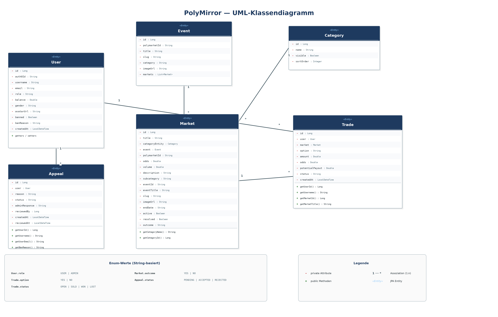

**Entity-Relationship-Modell (ERM)**

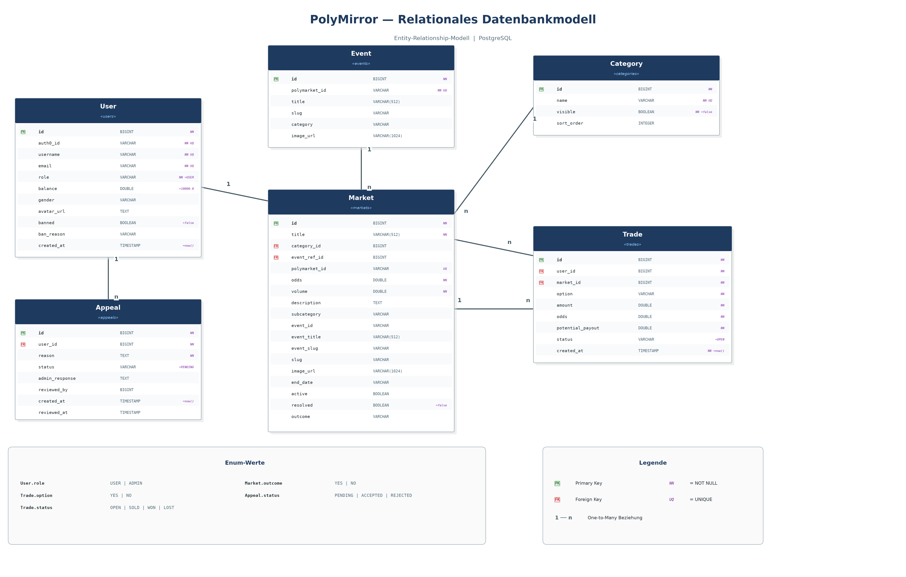

Das Datenmodell besteht aus sechs Entitäten:

**User**
- id (Long, PK), auth0Id (String, unique), username (String, unique), email (String, unique), role (String: USER/ADMIN), balance (Double), gender (String), avatarUrl (Text), banned (Boolean), banReason (String), createdAt (LocalDateTime)

**Event**
- id (Long, PK), polymarketId (String, unique), title (String), slug (String), category (String), imageUrl (String)
- Beziehung: 1 Event → * Markets

**Market**
- id (Long, PK), title (String), category_id (FK → Category), event_ref_id (FK → Event), polymarketId (String, unique), odds (Double), volume (Double), description (Text), subcategory (String), eventId (String), eventTitle (String), eventSlug (String), slug (String), imageUrl (String), endDate (String), active (Boolean), resolved (Boolean), outcome (String: YES/NO)

**Category**
- id (Long, PK), name (String, unique), visible (Boolean), sortOrder (Integer)

**Trade**
- id (Long, PK), user_id (FK → User), market_id (FK → Market), option (String: YES/NO), amount (Double), odds (Double), potentialPayout (Double), status (String: OPEN/SOLD/WON/LOST), createdAt (LocalDateTime)

**Appeal**
- id (Long, PK), user_id (FK → User), reason (Text), status (String: PENDING/ACCEPTED/REJECTED), adminResponse (Text), reviewedBy (Long), createdAt (LocalDateTime), reviewedAt (LocalDateTime)

---

## 2. Implementierung

### UC01: Benutzer registrieren

**Implementierung:** Die Registrierung wird vollständig über Auth0 (Identity Provider) abgewickelt. Der Nutzer klickt auf "Get Started" oder "Sign Up" und wird zum Auth0 Universal Login weitergeleitet. Dort gibt er E-Mail, Passwort ein oder nutzt Google Sign-In. Nach erfolgreicher Registrierung wird beim ersten Backend-Aufruf (`POST /api/users/me`) automatisch ein User-Eintrag mit 10.000 Poly Startguthaben erstellt.

- **Frontend:** `src/components/NavBar.vue` - Auth0 `loginWithRedirect()` mit `screen_hint: 'signup'`
- **Backend:** `UserController.java` - `POST /api/users/me` erstellt neuen User falls nicht vorhanden
- **Auth0:** Universal Login mit E-Mail/Passwort und Google OAuth

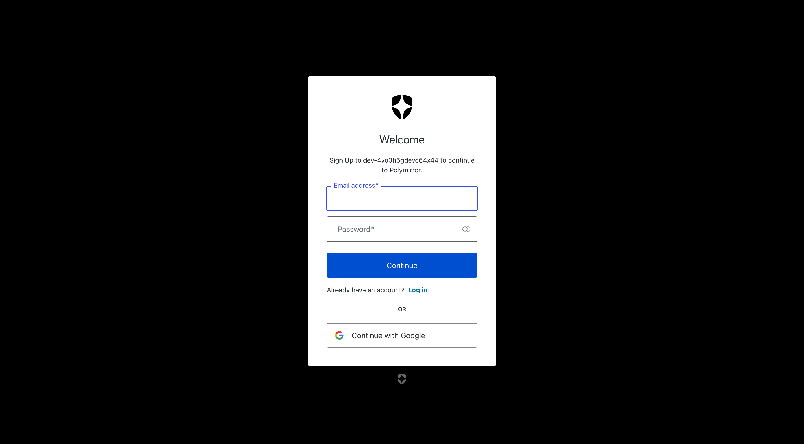

---

### UC02: E-Mail verifizieren

**Implementierung:** Die E-Mail-Verifizierung ist als Feature in Auth0 vollständig vorbereitet, wurde jedoch zu Demonstrationszwecken **nicht aktiviert**, damit Tester und Prüfer sich ohne E-Mail-Bestätigung sofort anmelden können.

**Aktivierung in Auth0 (3 Schritte):**
1. Im Auth0 Dashboard unter **Authentication > Database > Username-Password-Authentication** die Option **"Requires Verification"** aktivieren (standardmäßig bereits vorhanden, muss nur eingeschaltet werden).
2. Unter **Branding > Email Templates** kann die Verifizierungs-E-Mail angepasst werden (Absender, Betreff, Design).
3. Optional: Im Backend den JWT-Claim `email_verified` prüfen und nicht-verifizierte Nutzer von bestimmten Aktionen (z.B. Wetten platzieren) ausschließen.

Nach Aktivierung sendet Auth0 automatisch eine Verifizierungs-E-Mail nach jeder Registrierung. Der Status `email_verified` wird im JWT-Token mitgeliefert und kann vom Backend ausgewertet werden.

- **Auth0:** Verifizierungs-E-Mail Feature vorbereitet, zu Demozwecken deaktiviert
- **Backend:** JWT-Token enthält `email_verified` Claim (wird aktuell nicht erzwungen)

---

### UC03: Benutzer anmelden

**Implementierung:** Der Login erfolgt über Auth0 Universal Login. Nach erfolgreichem Login wird ein JWT-Token ausgestellt. Das Frontend speichert den Token und ruft `POST /api/users/me` auf, um die Nutzerdaten zu synchronisieren. Der User-Store (Pinia) speichert die Daten für die Session. Bei gesperrten Accounts wird ein 403-Fehler zurückgegeben und der Nutzer auf eine Banned-Seite weitergeleitet.

- **Frontend:** `src/stores/user.js` - `syncUser()` synchronisiert nach Login
- **Backend:** `UserController.java` - prüft `banned`-Status, synchronisiert Rolle aus Auth0-Token
- **Security:** `SecurityConfig.java` - JWT-Validierung über Auth0 JWKS

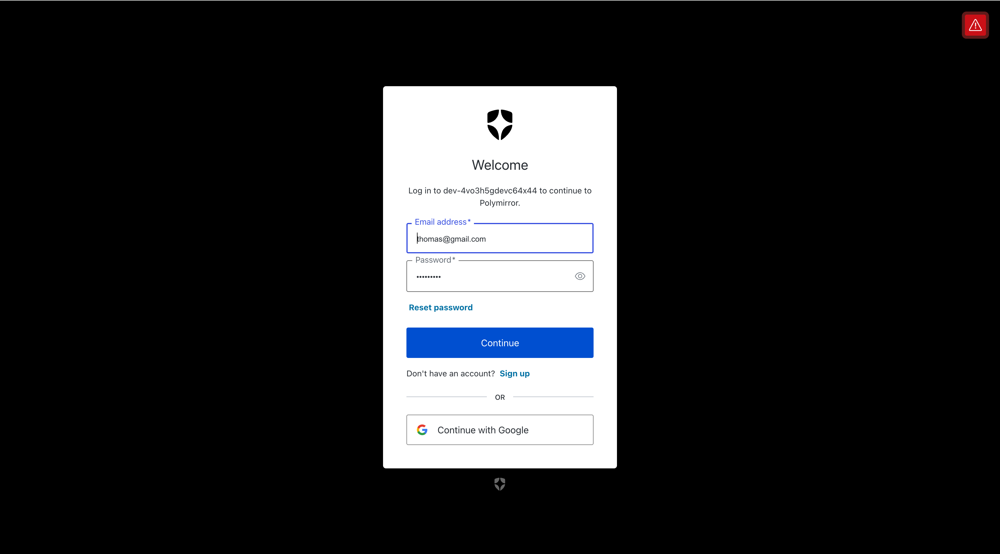

---

### UC04: Passwort zurücksetzen

**Implementierung:** Die Passwort-Reset-Funktion wird über die Auth0 Authentication API bereitgestellt. Das Frontend ruft die Auth0 `/dbconnections/change_password` API direkt auf. Auth0 sendet eine E-Mail mit Reset-Link.

- **Frontend:** `src/views/ProfileView.vue` - Button "Change Password" löst Auth0-API-Call aus

---

### UC05: Account löschen

**Implementierung:** Der Nutzer kann seinen Account über die Profilseite löschen. Nach Bestätigung in einem Confirmation-Dialog wird `DELETE /api/users/me` aufgerufen. Das Backend löscht alle zugehörigen Trades und den User-Eintrag. Anschließend wird der Nutzer ausgeloggt.

- **Frontend:** `src/views/ProfileView.vue` - "Delete Account" Button mit Bestätigungsdialog
- **Backend:** `UserController.java` - `DELETE /api/users/me` löscht Trades und User

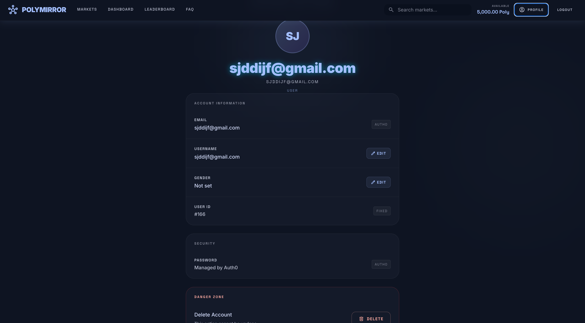
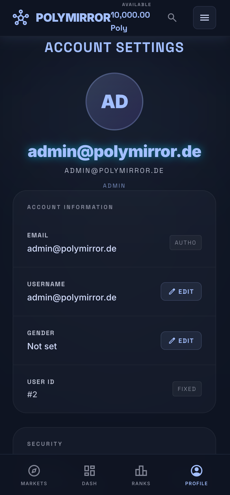

---

### UC06: Markets durchsuchen

**Implementierung:** Die Markets-Seite zeigt alle verfügbaren Prediction Markets, gruppiert nach Events. Die Markets werden seitenweise vom Backend geladen (`GET /api/markets/events`). Der Nutzer kann nach Kategorien filtern (über eine Sidebar mit allen verfügbaren Kategorien) und eine Volltextsuche nutzen. Jeder Market zeigt Titel, aktuelle Odds, Volumen und Enddatum. Bei Klick auf ein Event öffnet sich die Event-Detailseite mit allen zugehörigen Markets.

- **Frontend:** `src/views/MarketsView.vue` - Kategorie-Sidebar, Suchfeld, Infinite Scroll
- **Backend:** `MarketController.java` - `GET /api/markets/events` mit Pagination, Kategorie- und Suchfilter
- **Repository:** `MarketRepository.java` - `findDistinctEventIds()` für Event-basierte Gruppierung

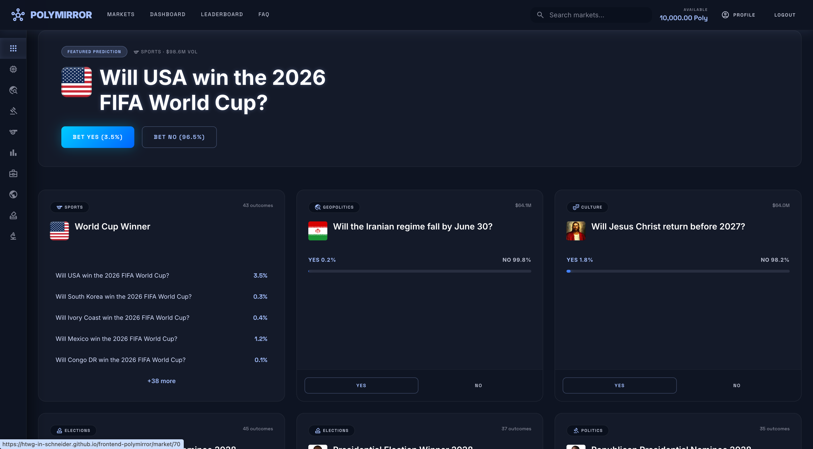
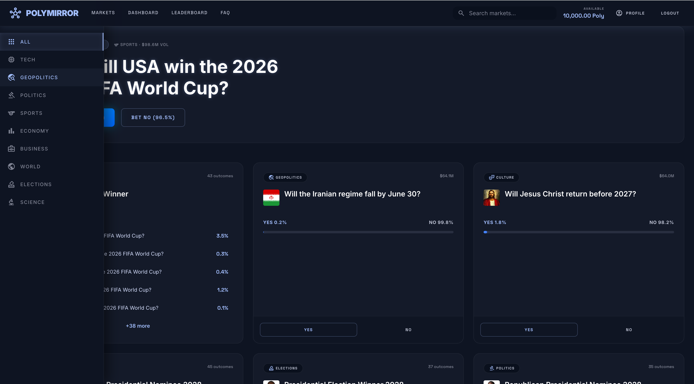
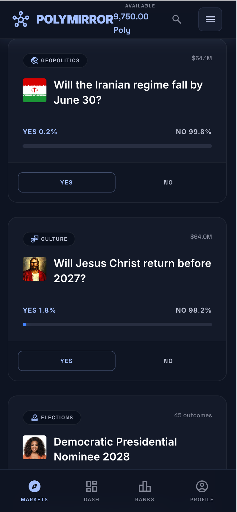
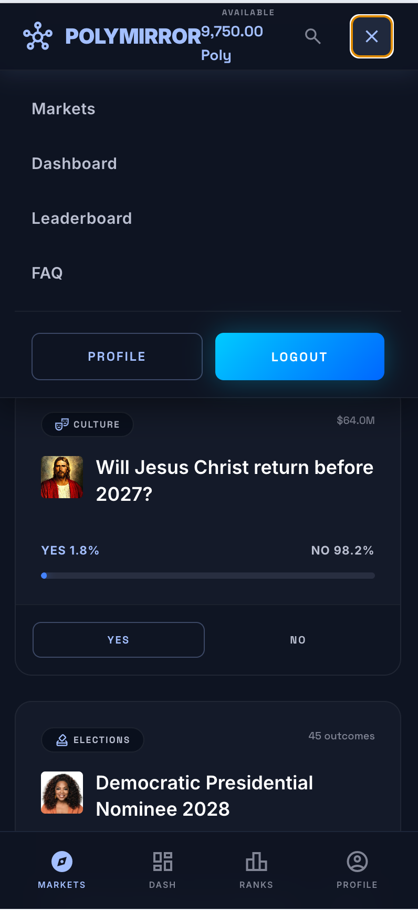

---

### UC07: Wette platzieren

**Implementierung:** Auf der Market-Detailseite kann der Nutzer eine Wette platzieren. Er wählt YES oder NO, gibt den Einsatz ein und sieht in Echtzeit den potenziellen Gewinn (berechnet aus aktuellem Odds). Nach Klick auf "Buy Shares" wird `POST /api/trades` aufgerufen. Das Backend validiert Guthaben, berechnet den Payout, zieht den Einsatz ab und erstellt den Trade. Eine Erfolgsmeldung wird angezeigt.

- **Frontend:** `src/views/MarketDetailView.vue` - Trade-Slip mit YES/NO-Auswahl, Betrag-Eingabe, Payout-Berechnung
- **Backend:** `TradeController.java` - `POST /api/trades` mit Validierung (Guthaben, Market-Status, Betragsgrenzen)

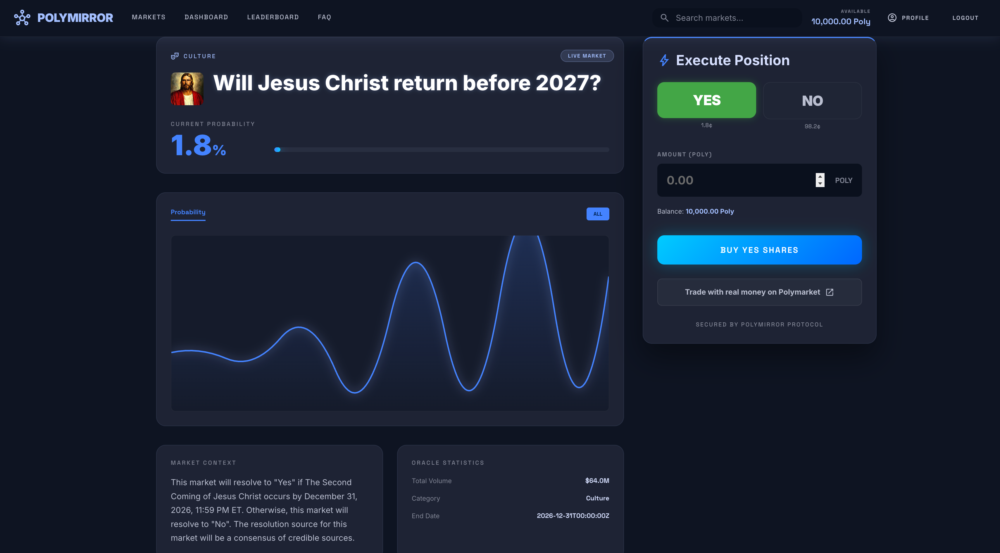
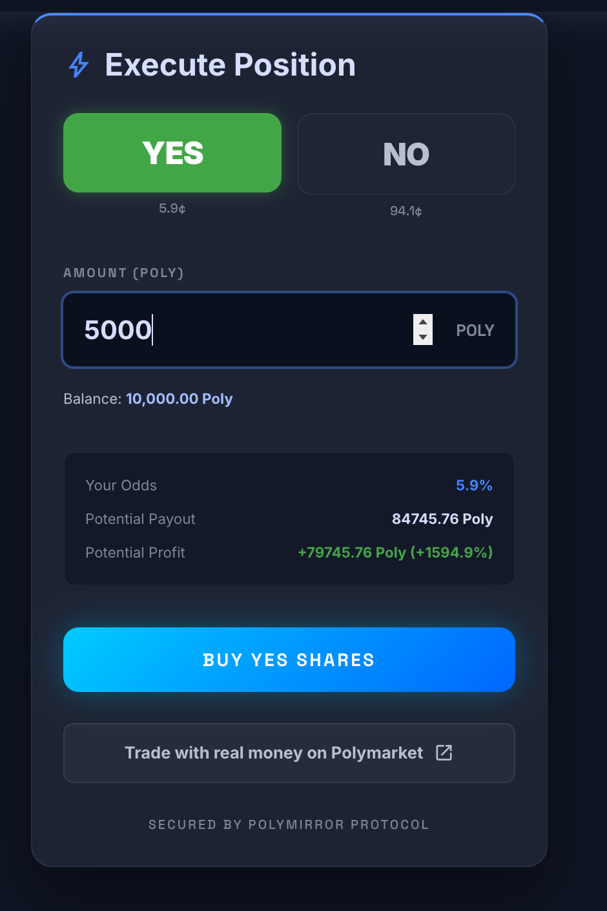
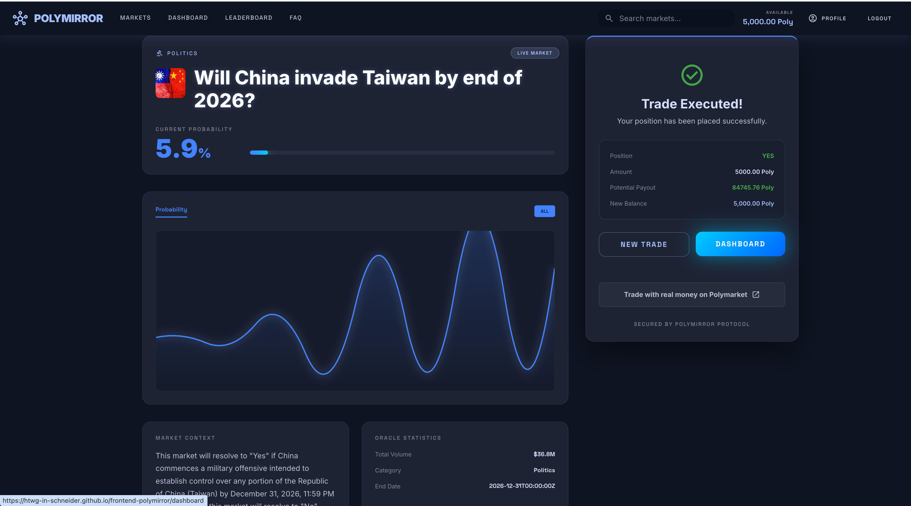

---

### UC08: Position verkaufen

**Implementierung:** Der Nutzer kann offene Positionen vor der Market-Resolution verkaufen. Im Dashboard oder auf der Market-Detailseite wird ein "Sell" Button angezeigt. Beim Verkauf wird der aktuelle Marktpreis verwendet, um den Verkaufswert zu berechnen (Shares x aktueller Preis). `POST /api/trades/sell/{tradeId}` führt den Verkauf durch, schreibt den Erlös gut und markiert den Trade als "SOLD".

- **Frontend:** `src/views/MarketDetailView.vue` - Sell-Button bei bestehenden Positionen
- **Backend:** `TradeController.java` - `POST /api/trades/sell/{tradeId}` berechnet Verkaufswert basierend auf aktuellen Odds

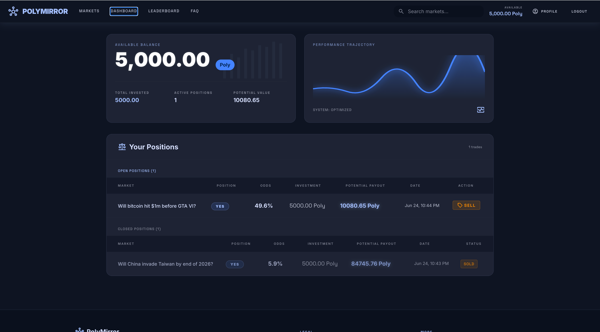

---

### UC09: Dashboard einsehen

**Implementierung:** Das Dashboard zeigt eine Übersicht der Trading-Performance. Oben werden KPIs angezeigt: Gesamtguthaben, täglicher P&L, Anzahl aktiver Positionen und Win-Rate. Ein Performance-Chart visualisiert den Verlauf. Darunter werden aktive und geschlossene Positionen in einer Tabelle aufgelistet. Die Daten werden über `GET /api/trades/me` geladen.

- **Frontend:** `src/views/DashboardView.vue` - KPI-Karten, Performance-Chart, Positions-Tabelle mit Tabs (Active/Closed)
- **Backend:** `TradeController.java` - `GET /api/trades/me` liefert alle Trades des Users

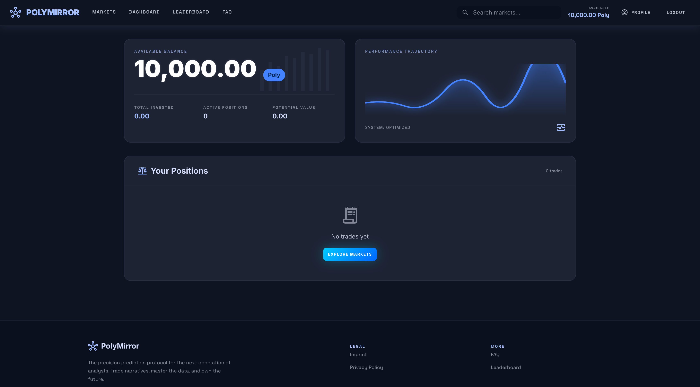

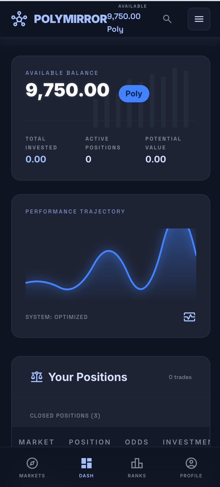
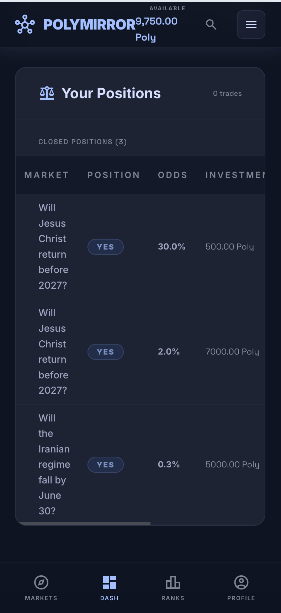

---

### UC10: Leaderboard ansehen

**Implementierung:** Das Leaderboard zeigt die Top-Trader sortiert nach Gesamtgewinn. Die Daten werden über `GET /api/leaderboard` geladen. Es zeigt Rang, Username, Balance, Gewinn (berechnet als Balance - 10.000 Startguthaben), Anzahl Trades und Win-Rate. Die Top 3 werden besonders hervorgehoben. Das Leaderboard ist auch für nicht angemeldete Nutzer sichtbar.

- **Frontend:** `src/views/LeaderboardView.vue` - Rangliste mit Stats-Karten (Total Players, Total Volume, etc.)
- **Backend:** `LeaderboardController.java` - `GET /api/leaderboard` berechnet Profit und Win-Rate pro User

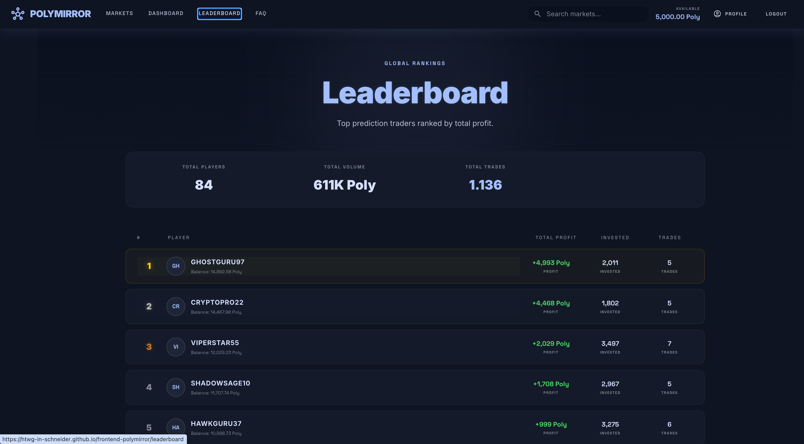
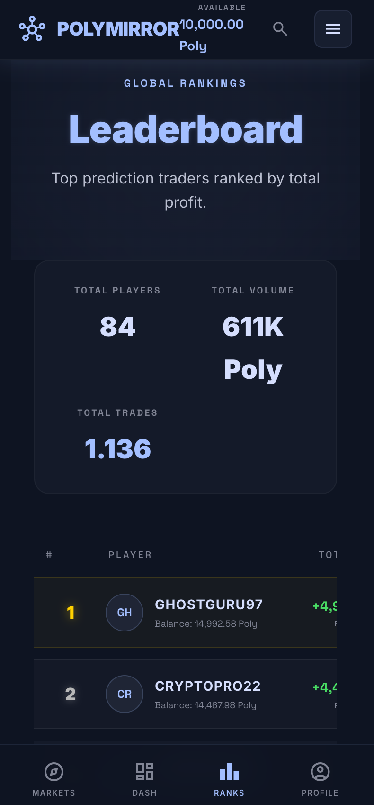

---

### UC11: Profil bearbeiten

**Implementierung:** Die Profilseite zeigt die Kontoinformationen des Nutzers. Der Username kann direkt bearbeitet werden (`PUT /api/users/me`). Das Passwort kann über Auth0 zurückgesetzt werden. Im "Danger Zone"-Bereich kann der Account gelöscht werden.

- **Frontend:** `src/views/ProfileView.vue` - Formular mit Username, E-Mail (readonly), Gender, User-ID
- **Backend:** `UserController.java` - `PUT /api/users/me` aktualisiert Username

---

### UC12: Wette auflösen

**Implementierung:** Die Wetten-Auflösung erfolgt automatisch über einen Scheduled Task im Backend. Der `PolymarketSyncService` prüft regelmäßig, ob Markets auf Polymarket als "resolved" markiert wurden. Falls ja, wird das Ergebnis (YES/NO) übernommen, der Market als resolved markiert und alle offenen Trades aufgelöst. Gewinner erhalten ihren `potentialPayout` gutgeschrieben, Verlierer verlieren ihren Einsatz. Der Trade-Status wird auf WON oder LOST gesetzt.

- **Backend:** `PolymarketSyncService.java` - `@Scheduled` Task prüft Polymarket API auf resolved Markets
- **Backend:** `MarketController.java` - `resolveMarket()` löst alle offenen Trades auf

---

### UC13: Market-Daten importieren

**Implementierung:** Ein Scheduled Task (`@Scheduled(fixedRate)`) im Backend synchronisiert regelmäßig Markets von der Polymarket CLOB API. Neue Markets werden importiert, bestehende Odds/Volumes aktualisiert. Die Kategorien werden automatisch aus den Polymarket-Tags abgeleitet und in der `Category`-Tabelle gespeichert. Der Admin kann über das Admin Panel auch manuell Markets erstellen.

- **Backend:** `PolymarketSyncService.java` - Automatische Synchronisation über Polymarket CLOB API
- **Backend:** `MarketController.java` - `POST /api/markets` für manuelle Market-Erstellung (Admin)
- **Externe API:** Polymarket CLOB API (`gamma-api.polymarket.com`)

---

### UC14: Nutzer sperren

**Implementierung:** Im Admin Panel (Users Tab) kann der Admin einen Nutzer sperren. Er klickt auf den "Ban"-Button und gibt optional einen Sperrgrund ein. `PUT /api/users/{id}/ban` setzt `banned=true` und speichert den `banReason`. Beim nächsten Login-Versuch erhält der gesperrte Nutzer einen 403-Fehler und wird auf die Banned-Seite weitergeleitet, die den Sperrgrund anzeigt und die Möglichkeit zum Einspruch bietet.

- **Frontend:** `src/views/AdminView.vue` - Users Tab mit Ban/Unban Buttons
- **Backend:** `UserController.java` - `PUT /api/users/{id}/ban`
- **Frontend:** `src/views/BannedView.vue` - Sperrseite mit Einspruchsformular

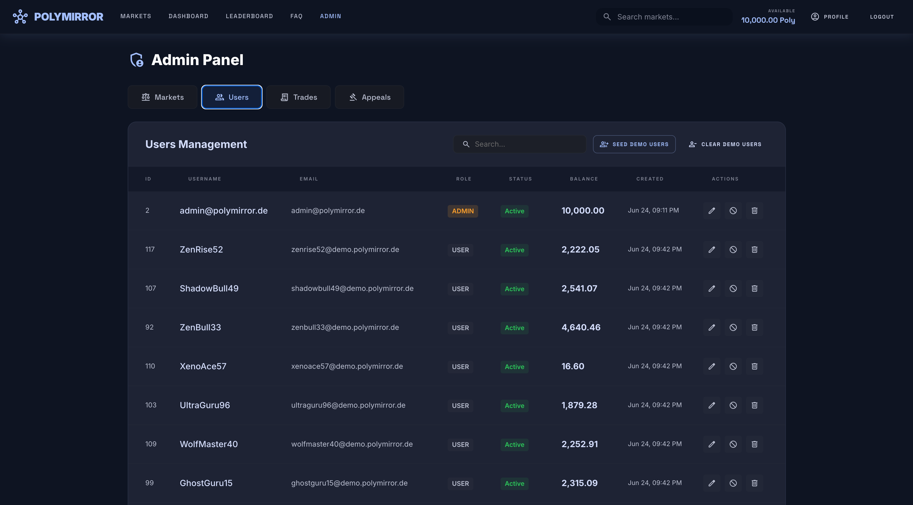

---

### UC15: Nutzer entsperren

**Implementierung:** Der Admin kann gesperrte Nutzer über den "Unban"-Button im Admin Panel entsperren (`PUT /api/users/{id}/unban`). Alternativ wird ein Nutzer automatisch entsperrt, wenn ein Einspruch akzeptiert wird.

- **Frontend:** `src/views/AdminView.vue` - Unban-Button bei gesperrten Nutzern
- **Backend:** `UserController.java` - `PUT /api/users/{id}/unban` setzt `banned=false`

---

### UC16: Nutzerdaten einsehen

**Implementierung:** Im Admin Panel (Users Tab) werden alle registrierten Nutzer in einer Tabelle angezeigt mit ID, Username, E-Mail, Rolle, Status (Active/Banned), Balance und Erstellungsdatum. Eine Suchfunktion ermöglicht das Filtern nach Username oder E-Mail. Der Admin kann die Rolle (USER/ADMIN) und den Username direkt inline bearbeiten.

- **Frontend:** `src/views/AdminView.vue` - Users Tab mit Suche, Inline-Editing
- **Backend:** `UserController.java` - `GET /api/users` (Admin), `PUT /api/users/{id}` für Änderungen

---

### UC17: Einspruch gegen Sperrung einlegen

**Implementierung:** Gesperrte Nutzer werden nach dem Login auf die Banned-Seite weitergeleitet. Dort können sie über ein Textfeld eine Begründung eingeben und den Einspruch absenden (`POST /api/appeals`). Der Einspruch wird mit Status "PENDING" gespeichert und erscheint im Admin Panel.

- **Frontend:** `src/views/BannedView.vue` - Einspruchsformular mit Begründungsfeld
- **Backend:** `AppealController.java` - `POST /api/appeals` erstellt neuen Einspruch

---

### UC18: Einspruch bearbeiten

**Implementierung:** Im Admin Panel (Appeals Tab) werden alle Einsprüche aufgelistet mit Username, E-Mail, Status (PENDING/ACCEPTED/REJECTED), Sperrgrund, Einspruchsbegründung und Datum. Der Admin kann eine Antwort eingeben und den Einspruch akzeptieren (Nutzer wird automatisch entsperrt) oder ablehnen. Bei Akzeptanz wird `PUT /api/appeals/{id}/accept` aufgerufen, bei Ablehnung `PUT /api/appeals/{id}/reject`.

- **Frontend:** `src/views/AdminView.vue` - Appeals Tab mit Antwortfeld und Accept/Reject Buttons
- **Backend:** `AppealController.java` - `PUT /api/appeals/{id}/accept` und `PUT /api/appeals/{id}/reject`

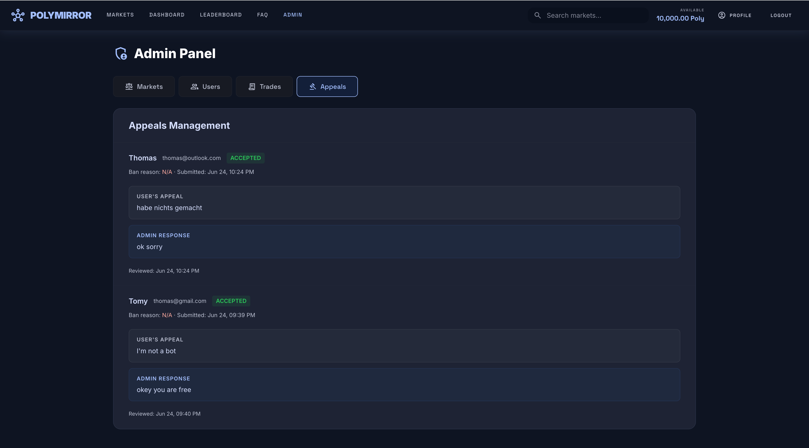

---

### Weitere Seiten

**Landing Page**

Die Landing Page ist der Einstiegspunkt der Applikation. Sie zeigt einen Hero-Bereich mit dem Slogan "Trade Polymarket risk-free." und CTA-Buttons ("Get Started", "View Markets"). Darunter werden Featured Predictions aus verschiedenen Kategorien angezeigt. Für eingeloggte Nutzer ändert sich der CTA zu "View Markets".

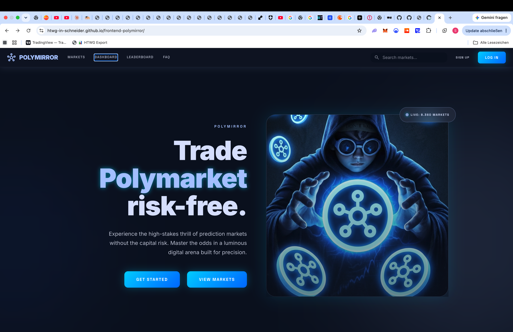

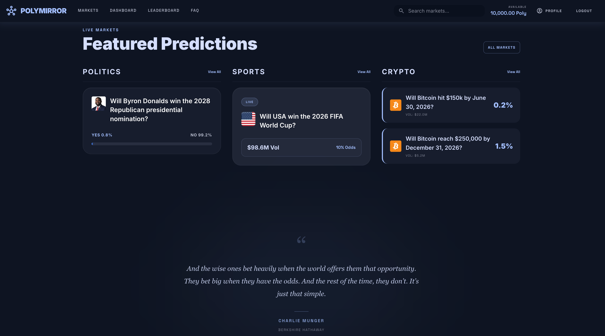

**Admin Panel - Markets**

Der Admin kann alle importierten Markets einsehen, bearbeiten und neue Markets manuell erstellen. Die Markets-Tabelle zeigt Titel, Kategorie, Odds, Volumen und Status.

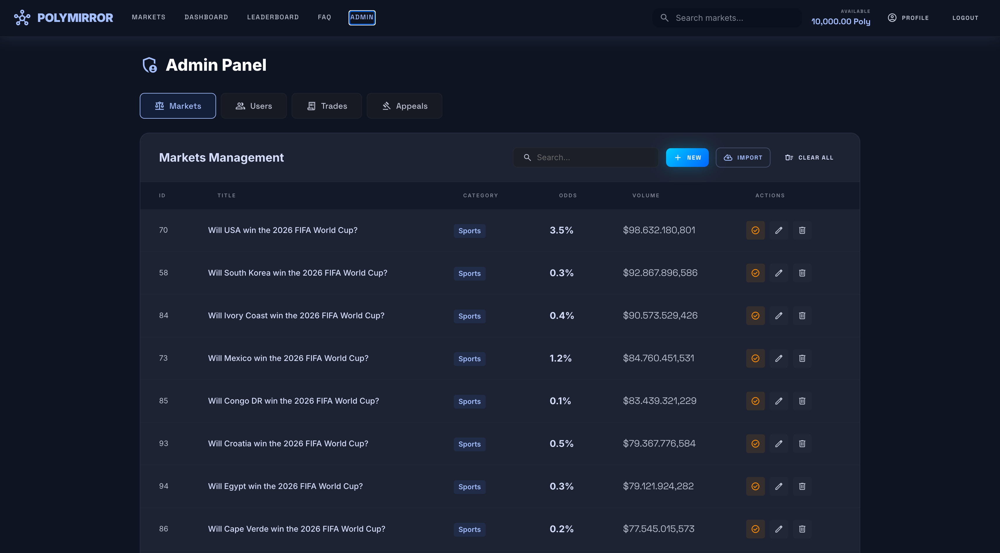
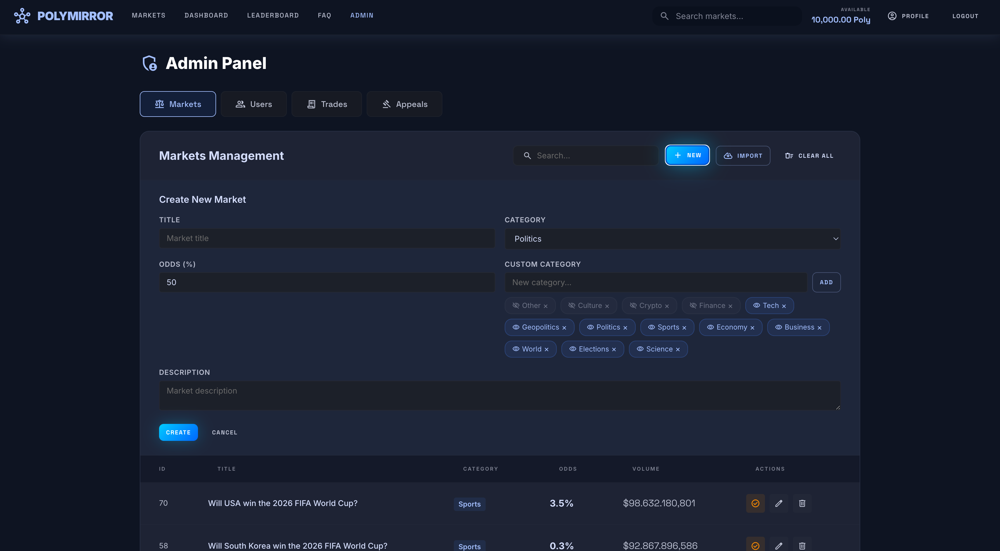
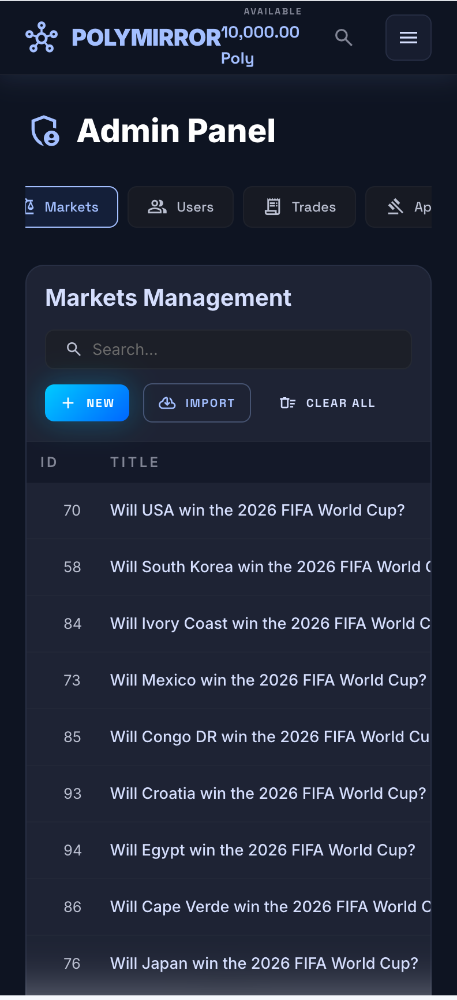

**Admin Panel - Trades**

Der Admin hat Einsicht in alle platzierten Trades mit Suchfunktion.

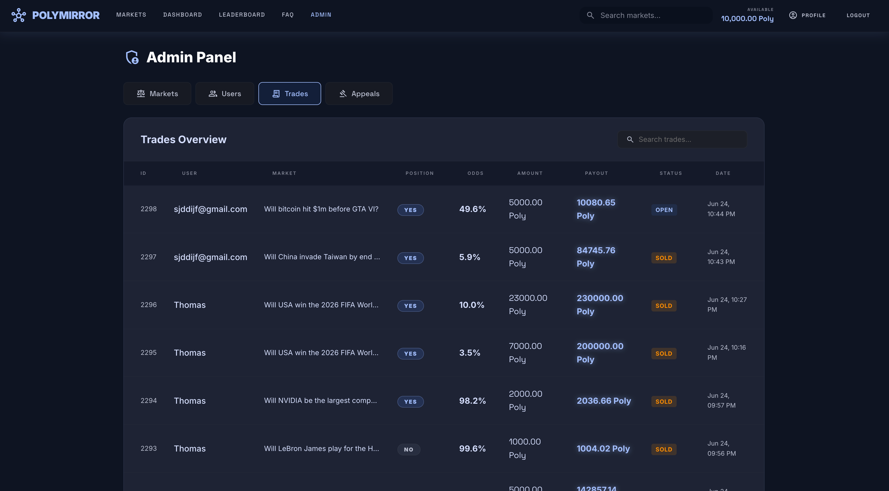

**FAQ / Help Center**

Eine FAQ-Seite beantwortet häufige Fragen zur Plattform.

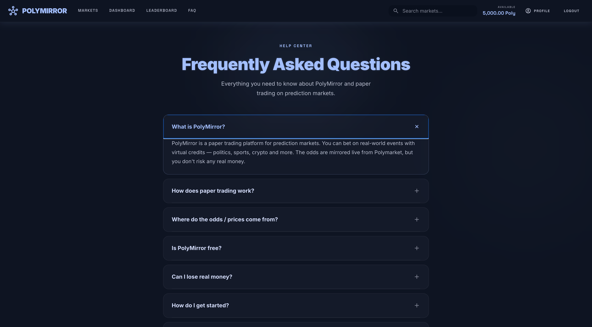

**Kontakt & Impressum**

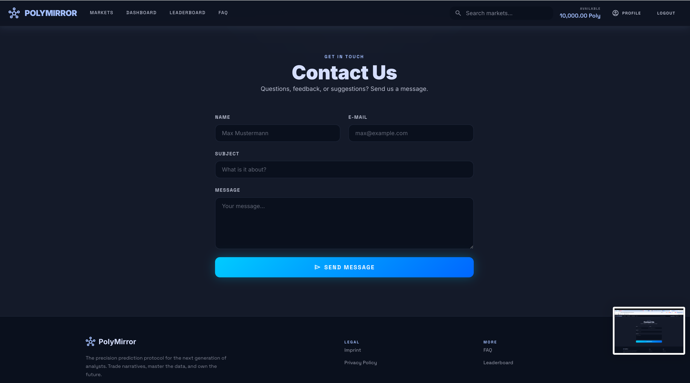
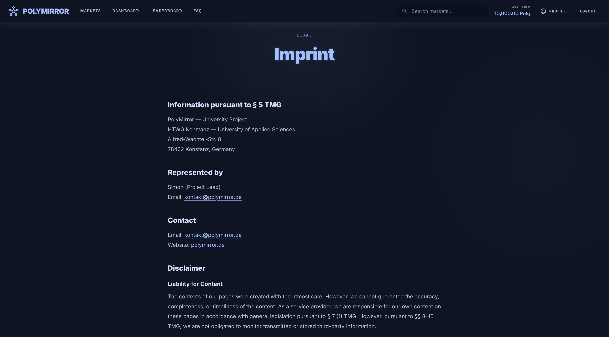

**Event-Detailseite**

Bei Events mit mehreren Markets (z.B. "World Cup Winner") werden alle zugehörigen Markets auf einer Gruppendetailseite angezeigt.

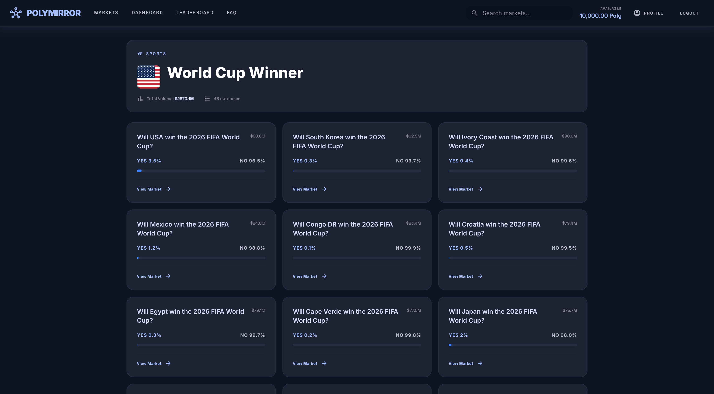

---

## 3. Bereitstellung

### URLs

| Komponente | URL |
|---|---|
| Frontend (Live) | https://htwg-in-schneider.github.io/frontend-polymirror/ |
| Backend API (Live) | https://backend-polymirror.onrender.com/api |
| Frontend Repository | https://github.com/htwg-in-schneider/frontend-polymirror |
| Backend Repository | https://github.com/htwg-in-schneider/backend-polymirror |

### Test-Zugangsdaten

**Normaler User:**
| Feld | Wert |
|---|---|
| E-Mail | syconnect00@gmail.com |
| Passwort | Admin123! |
| Rolle | USER |

**Admin:**
| Feld | Wert |
|---|---|
| E-Mail | admin@polymirror.de |
| Passwort | Admin123! |
| Rolle | ADMIN |

> **Hinweis:** Die Anmeldung erfolgt über Auth0 Universal Login. Der Admin-Account hat Zugang zum Admin Panel unter `/admin`. Die E-Mail-Verifizierung ist zu Demonstrationszwecken deaktiviert (siehe UC02).

### Hart-codierte Werte

Die folgenden Werte sind bewusst direkt im Code definiert und nicht in externe Konfigurationsdateien ausgelagert. Dies hat zwei Gründe: Erstens handelt es sich um fachliche Konstanten, die sich zur Laufzeit nicht ändern und fest zur Geschäftslogik gehören. Zweitens würde eine Externalisierung in Konfigurationsdateien die Komplexität erhöhen, ohne einen praktischen Mehrwert zu bieten, da diese Werte in keinem Deployment-Szenario angepasst werden müssen.

**Business-Logik Konstanten (Backend):**

| Wert | Stelle | Begründung |
|---|---|---|
| Startguthaben: `10.000 Poly` | UserController.java | Feste Spielregel der Plattform — jeder neue Nutzer erhält denselben Betrag |
| Maximaler Einsatz: `1.000.000 Poly` | TradeController.java | Schutz vor unrealistischen Wetten, feste Obergrenze |
| Max. Einspruchslänge: `1000 Zeichen` | AppealController.java | UI-Validierungsregel, verhindert Missbrauch |
| Max. Titel-Länge: `500 Zeichen` | MarketController.java | Datenbankfeld-Begrenzung, konsistent mit Schema |
| Max. Kategoriename: `50 Zeichen` | CategoryController.java | UI-Darstellungsbegrenzung |
| Resolution-Threshold: `0.95` | PolymarketImportService.java | Polymarket-Konvention: Preis >= 95% gilt als entschieden |
| Sync-Intervall: `600.000ms (10 Min.)` | PolymarketImportService.java | Balance zwischen Aktualität und API-Rate-Limits |

**Externe API (Backend):**

| Wert | Stelle | Begründung |
|---|---|---|
| Polymarket API URL | PolymarketImportService.java | Offizielle, stabile API-URL von Polymarket (gamma-api.polymarket.com) — ändert sich nicht |
| Auth0 Roles Claim URL | SecurityConfig.java, UserController.java | Auth0-Namenskonvention für Custom Claims, fest an den Tenant gebunden |

**CORS-Origins (Backend):**

| Wert | Stelle | Begründung |
|---|---|---|
| `localhost:5173`, `localhost:5174` | SecurityConfig.java | Lokale Entwicklungsserver-Ports von Vite, werden nur im Development verwendet |
| GitHub Pages URL | SecurityConfig.java | Produktions-URL, fest an das Deployment gebunden |

**Frontend:**

| Wert | Stelle | Begründung |
|---|---|---|
| `kontakt@polymirror.de` | HomeView, ImpressumView, DatenschutzView | Kontakt-E-Mail-Adresse in statischen Seiten — kein Konfigurationswert, sondern Seiteninhalt |

Alle sicherheitsrelevanten und umgebungsabhängigen Werte (Auth0 Domain, Client-ID, API-Base-URL) sind korrekt in `.env`-Dateien (Frontend) bzw. `application.properties` mit Umgebungsvariablen (Backend) ausgelagert.
